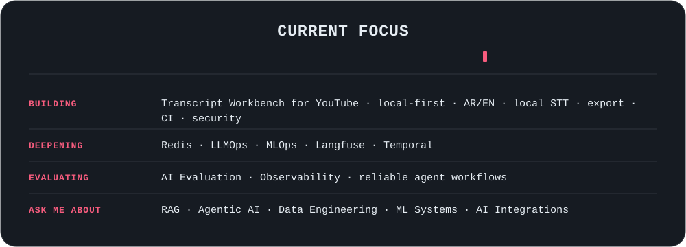
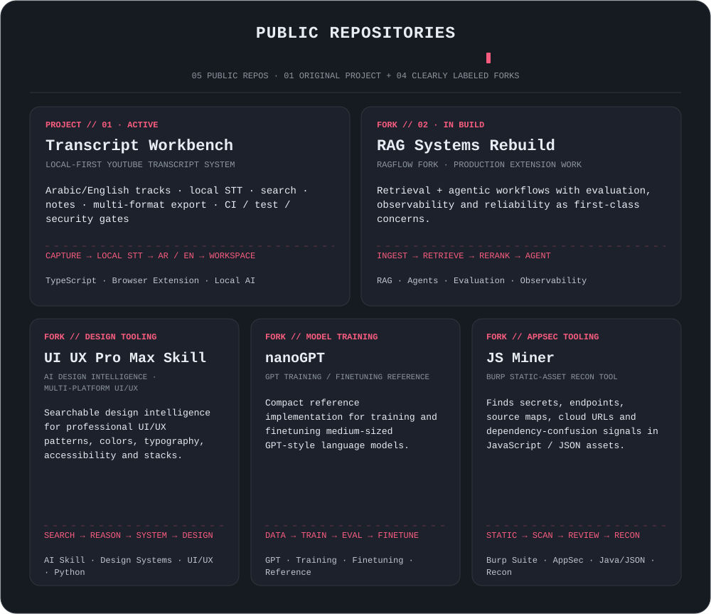
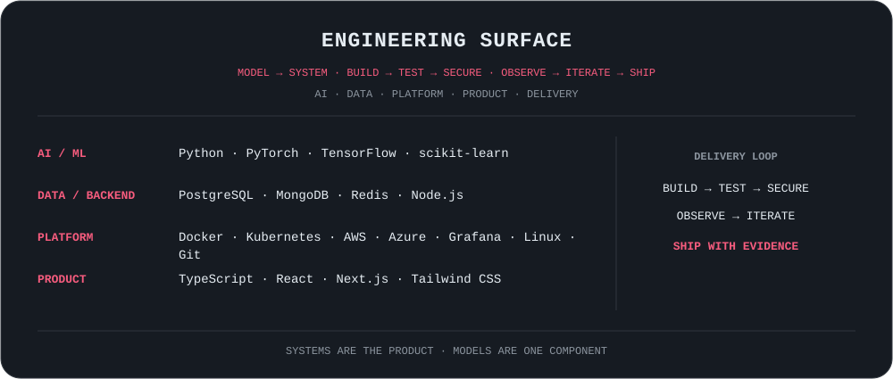
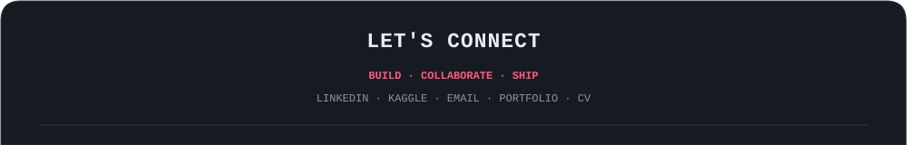
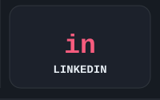
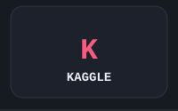
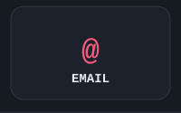
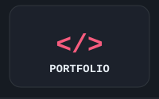
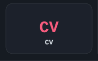

<picture>
  <source media="(max-width: 600px)" srcset="./assets/generated/hero-mobile.svg" />
  
</picture>

<picture>
  <source media="(max-width: 600px)" srcset="./assets/generated/now-mobile.svg" />
  
</picture>

<picture>
  <source media="(max-width: 600px)" srcset="./assets/generated/projects-mobile.svg" />
  
</picture>

  <a href="https://github.com/koko-88/yt_transcriber">Transcript Workbench</a> ·
  <a href="https://github.com/koko-88/rag_project">RAG Systems Rebuild (fork)</a> ·
  <a href="https://github.com/koko-88/ui-ux-pro-max-skill">UI UX Pro Max Skill (fork)</a> ·
  <a href="https://github.com/koko-88/nanoGPT">nanoGPT (fork)</a> ·
  <a href="https://github.com/koko-88/js-miner">JS Miner (fork)</a>

<picture>
  <source media="(max-width: 600px)" srcset="./assets/generated/surface-mobile.svg" />
  
</picture>

<picture>
  <source media="(max-width: 600px)" srcset="./assets/generated/connect-mobile.svg" />
  
</picture> 
<a href="https://linkedin.com/in/kmg-datascience" title="LinkedIn"><picture><source media="(max-width: 600px)" srcset="./assets/generated/social-linkedin-mobile.svg" /></picture></a><a href="https://kaggle.com/kerolosmounir" title="Kaggle"><picture><source media="(max-width: 600px)" srcset="./assets/generated/social-kaggle-mobile.svg" /></picture></a><a href="mailto:kerolosmounir099@gmail.com" title="Email"><picture><source media="(max-width: 600px)" srcset="./assets/generated/social-email-mobile.svg" /></picture></a><a href="https://v0-kerolos88.vercel.app" title="Portfolio"><picture><source media="(max-width: 600px)" srcset="./assets/generated/social-portfolio-mobile.svg" /></picture></a><a href="https://drive.google.com/file/d/1LLx5v1dsp70mzl6Ov8e6Ofv6hsaw7FuI/view?usp=sharing" title="CV"><picture><source media="(max-width: 600px)" srcset="./assets/generated/social-cv-mobile.svg" /></picture></a>

